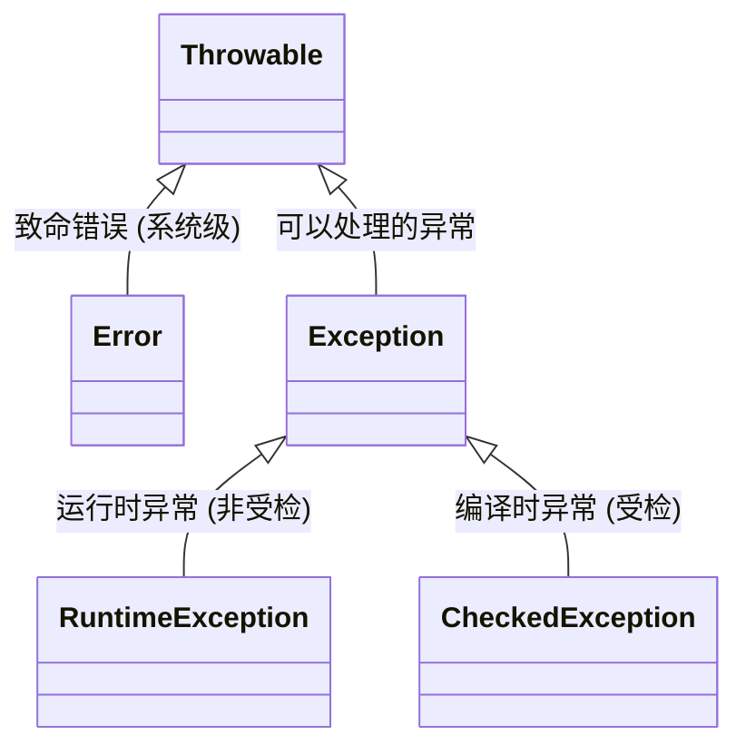

# 9. 异常处理

学习目标：
1. 理解什么是异常，以及异常的分类。
2. 掌握 `try-catch-finally` 捕获异常的机制。
3. 区分 `throw` 和 `throws`。
4. 学会自定义异常。

---

## 1. 什么是异常？

在程序运行过程中，出现的不正常情况叫做异常（Exception）。
例如：
- 试图打开一个不存在的文件。
- 网络连接中断。
- 试图计算除以 0 的算术题 (`10 / 0`)。

如果不处理异常，程序会直接崩溃（Crash）并停止运行。处理异常的目的，就是让程序在出错时能执行预案（比如提示用户、记录日志），而不是直接挂掉。

---

## 2. 异常体系结构 (重点)

Java 中的异常有一个严密的家族体系，根类是 `java.lang.Throwable`。



### 核心分类：

1.  Error (错误)
    *   特点：通常是 JVM 系统级的大问题，程序无法处理。
    *   例子：`OutOfMemoryError` (内存溢出), `StackOverflowError` (栈溢出)。
    *   对策：别 `catch` 它，直接改代码或调整服务器配置。

2.  Exception (异常) - 我们需要关注的
    *   编译时异常 (Checked Exception):
        *   特点：编译器强制你处理（IDE 会画红线）。如果你不写 `try-catch` 或 `throws`，代码编译不过去。
        *   场景：外部环境问题，如文件读取 (`IOException`)、数据库连接 (`SQLException`)。
    *   运行时异常 (Runtime Exception / Unchecked):
        *   特点：编译器不管，运行的时候才会报错。通常是因为代码逻辑写错了。
        *   例子：
            *   `NullPointerException` (空指针，NPE) —— *Java 程序员的一生之敌*。
            *   `ArithmeticException` (算术异常，如除以 0)。
            *   `ArrayIndexOutOfBoundsException` (数组下标越界)。

---

## 3. 捕获异常 (`try-catch-finally`)

这是自己解决异常的方式。

### 语法结构

```java
try {
    // 1. 可能产生异常的代码区
    // 一旦这里出错，后续代码不再执行，直接跳入 catch
} catch (异常类型 变量名) {
    // 2. 捕获异常后的处理方案
    // 比如：打印错误日志、给用户弹窗提示
} finally {
    // 3. 善后区 (可选)
    // 无论是否发生异常，这里的代码 一定 会执行
    // 通常用于释放资源（关闭文件、数据库连接）
}
```

### 实战代码示例

```java
public class ExceptionDemo {
    public static void main(String[] args) {
        System.out.println("程序开始");
        try {
            int a = 10;
            int b = 0;
            // 下面这行会抛出 ArithmeticException
            int result = a / b; 
            System.out.println("结果是：" + result); // 这行不会执行
        } catch (ArithmeticException e) {
            // 捕获到算术异常
            System.out.println("出错了！不能除以0");
            e.printStackTrace(); // 打印详细报错信息到控制台(调试用)
        } catch (Exception e) {
            // 多重捕获：通常把父类 Exception 放在最后兜底
            System.out.println("发生了其他未知异常");
        } finally {
            System.out.println("我是 finally，我一定会被执行");
        }
        System.out.println("程序结束"); // 程序没有崩溃，继续向下运行
    }
}
```

---

## 4. 抛出异常 (`throw` vs `throws`)

有时候我们不想（或不能）在当前方法处理异常，可以把锅“甩”给调用者。

### 对比表

| 关键字 | 位置 | 含义 | 作用 |
| :--- | :--- | :--- | :--- |
| throw | 方法体内部 | 抛出一个异常对象 | 制造异常。执行到这就报错。 |
| throws | 方法声明处 (参数列表后) | 声明该方法可能出现的异常类型 | 甩锅。告诉调用者：这方法有风险，你看着办。 |

### 实战代码示例

```java
// 使用 throws 告诉调用者，这里可能会有异常
public void readFile(String filePath) throws FileNotFoundException {
    if (filePath == null) {
        // 使用 throw 主动抛出一个异常对象
        throw new IllegalArgumentException("文件路径不能为空！");
    }
    
    // 模拟文件操作
    if (!filePath.equals("c:/data.txt")) {
        throw new FileNotFoundException("文件没找到: " + filePath);
    }
}

// 调用者必须处理这个异常
public void main(String[] args) {
    try {
        readFile("xxx.txt");
    } catch (FileNotFoundException e) {
        System.out.println("文件读取失败，请检查路径");
    }
}
```

---

## 5. 自定义异常

Java 自带的异常不够用时（比如业务逻辑错误），我们需要自定义异常。

### 步骤：
1. 继承 `RuntimeException` (推荐，代码更简洁) 或 `Exception`。
2. 提供构造方法。

### 实战代码示例

模拟银行转账，余额不足的情况。

```java
// 1. 定义异常类
public class BalanceNotEnoughException extends RuntimeException {
    public BalanceNotEnoughException(String message) {
        super(message); // 将错误信息传给父类
    }
}

// 2. 在业务代码中使用
public class Account {
    private double balance = 100.0;

    public void withdraw(double money) {
        if (money > balance) {
            // 抛出自定义异常
            throw new BalanceNotEnoughException("余额不足，当前余额：" + balance);
        }
        balance -= money;
        System.out.println("取款成功");
    }
}
```

---

## 6. 开发中的最佳实践 (避坑指南)

1.  不要吞掉异常：
    *   ❌ 错误写法：`catch (Exception e) { }` // 什么都不做
    *   ✅ 正确写法：至少要 `e.printStackTrace()` 或记录日志，否则出 Bug 查不到原因。
2.  提倡使用 RuntimeException：
    *   在现代 Java 开发（尤其是 Spring 框架）中，业务异常通常继承 `RuntimeException`，因为这样不需要层层写 `try-catch`，可以由框架统一在最外层处理。
3.  精确捕获：
    *   尽量 `catch` 具体的异常（如 `NullPointerException`），而不是一来就 `catch (Exception e)`，这样能更精准地定位问题。
4.  Finally 陷阱：
    *   不要在 `finally` 块中写 `return` 语句，这会覆盖掉 `try` 块中的返回值。

---

## 📝 课后练习

1.  编写一个程序，接收用户输入的字符串，尝试将其转换为整数。如果用户输入的不是数字（抛出 `NumberFormatException`），则提示用户“请输入合法的数字”。
2.  定义一个 `AgeInvalidException`，当用户输入的年龄 < 0 或 > 150 时抛出该异常。

---

*下一步建议：熟练掌握异常处理后，就可以进入 IO 流 的学习，因为文件操作和网络传输中充满了各种异常，这里是应用异常处理的最佳战场。*